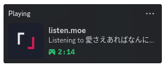

# DEPRECATED: Use https://github.com/Parsa-GP/music-rpc

# listen.moe DiscordRPC

## Playing listen.moe songs + DiscordRPC
This script lets you stream songs from listen.moe
and provides Discord RPC Support

### Demonstration:



## How to Run
<details>
<summary>Linux</summary>

``` sh
# To run from enviorment
source .venv/bin/activate
# To install the neccesary packages
pip install -r requirements.txt

# Run the script
python listen-moe.py
```
</details>
<details>
<summary>Windows</summary>

``` sh
# To run from enviorment
.venv\Scripts\Activate.ps1
# To install the neccesary packages
pip install -r requirements.txt

# Run the script
python listen-moe.py
```
</details>

